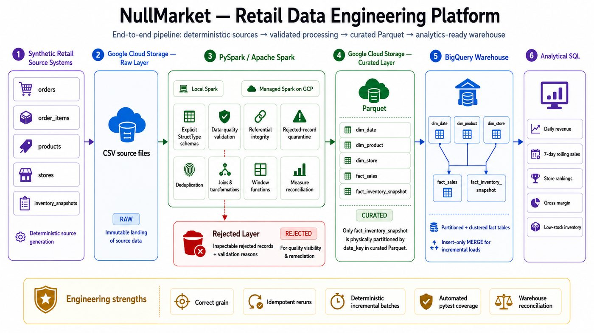
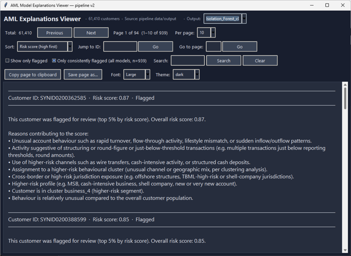

# Hi, I'm Danny Han

**Data Engineer & Business Intelligence Analyst | Python, PySpark, SQL, GCP, BigQuery, Power BI**  
**Microsoft Certified: Power BI Data Analyst Associate**

I build data systems that turn operational data into reliable analytical datasets and decision-ready reporting. My work spans PySpark pipelines, SQL data modelling, dimensional design, data-quality controls, cloud warehousing, KPI development, dashboarding, validation, and documentation.

I am currently completing an Honours Bachelor of Science in Computer Science and Statistics at the University of Toronto Mississauga. I am particularly interested in data engineering and analytics roles where I can build trustworthy pipelines, model data carefully, and make downstream analysis easier to use and defend.

I care about the engineering details that make data trustworthy: explicit schemas, correct grain, sound keys and relationships, reproducible transformations, strong validation, and documentation that someone else can actually follow.

## Featured projects

### [NullMarket — Retail Data Engineering Platform](https://github.com/code-of-toad/nullmarket-retail-data-engineering-platform)

**PySpark • Apache Spark • SQL • Google Cloud Storage • BigQuery • Parquet • pytest**

<p align="center">
  <a href="https://github.com/code-of-toad/nullmarket-retail-data-engineering-platform">
    
  </a>
</p>

An end-to-end batch data engineering platform for a fictional Canadian retailer, built to demonstrate reliable ingestion, distributed transformation, dimensional modelling, cloud storage, warehouse loading, data quality, testing, and incremental processing.

```text
Synthetic Sources
    ↓
Google Cloud Storage — Raw
    ↓
PySpark / Managed Apache Spark
    ├─ Explicit schemas
    ├─ Data-quality validation
    ├─ Rejected-record quarantine
    ├─ Cleansing + joins
    └─ Business transformations
    ↓
Google Cloud Storage — Curated Parquet
    ↓
BigQuery Dimensional Warehouse
    ↓
Analytical SQL
```

- Integrated five retail source datasets with explicitly declared grains and PySpark `StructType` schemas
- Built reusable validation for required fields, key uniqueness, referential integrity, numeric business rules, and rejected-record handling
- Designed conformed `dim_date`, `dim_product`, and `dim_store` dimensions with separate sales and inventory fact tables
- Reused the same transformation logic for local Spark and Google-managed Spark execution
- Persisted curated datasets as Parquet and validated schema, grain, row counts, measures, and round-trip correctness
- Built partitioned and clustered BigQuery fact tables for analytical workloads
- Added automated pytest coverage and independent warehouse reconciliation
- Implemented deterministic incremental batches with stable surrogate-key mappings and retry-safe insert-only BigQuery `MERGE`

---

### [ClinicalPulse — Healthcare Business Intelligence Platform](https://github.com/code-of-toad/clinical-pulse-healthcare-bi)

[](https://github.com/code-of-toad/clinical-pulse-healthcare-bi)

[](https://github.com/code-of-toad/clinical-pulse-healthcare-bi/blob/main/docs/architecture_diagram.png)

A governed hospital BI platform built with synthetic EHR data, SQL Server, Python, and Power BI.

- Built bronze, silver, and gold SQL Server data layers from seven source entities
- Designed a reporting-ready dimensional model with 20 gold-layer objects
- Developed seven Power BI report pages for patient flow, length of stay, readmissions, service utilization, observation activity, and reporting trust
- Reconciled governed KPI logic across SQL and DAX
- Implemented ingestion auditing, data-quality controls, lineage, asset scorecards, and security documentation
- Delivered the project through Git, GitHub, and Azure DevOps Boards

---

### [Anti-Money Laundering Risk Detection and Decision-Support Pipeline](https://github.com/code-of-toad/AML-Detection-Pipeline-Project)

<p align="center">
  <a href="https://github.com/code-of-toad/AML-Detection-Pipeline-Project">
    
  </a>
</p>

An end-to-end AML analytics system that combines domain-informed risk rules with unsupervised machine-learning models to identify and explain potentially suspicious customer behaviour.

- Earned a top-five placement in an AML analytics competition hosted by the University of Toronto IMI BigDataAIHub and Scotiabank, involving approximately 490 participants across 90 teams
- Built reproducible workflows for feature preparation, behavioural clustering, rule-based risk scoring, anomaly detection, score fusion, and output generation
- Combined rule-based indicators with model-generated anomaly scores to produce interpretable customer risk assessments
- Created plain-language explanations that connect model outputs to AML red-flag categories for non-technical reviewers
- Built a desktop explanation viewer for browsing, filtering, and searching customer-level risk explanations
- Designed a modular model interface that allows additional detection algorithms to be incorporated without changing the core pipeline

<p align="center">
  <a href="https://github.com/code-of-toad/AML-Detection-Pipeline-Project">
    
  </a>
</p>

---

### [CSSU Rewards System API](https://github.com/code-of-toad/project_ecommerce_system_backend)

A RESTful backend API for a points-based rewards platform, designed around secure access, relational data integrity, and maintainable business logic.

- Built the application with Node.js, Express.js, Prisma ORM, and SQLite using a layered routes, controllers, services, and middleware architecture
- Implemented JWT authentication, password hashing, input validation, and four-tier role-based access control
- Designed a relational schema for users, transactions, promotions, events, and password-reset tokens with version-controlled migrations
- Developed transaction, promotion, and points-management workflows with pagination, validation, and consistent error handling

## Additional analytics work

| Project | What it demonstrates | Core tools |
|---|---|---|
| [Student Mental Health Analysis](https://github.com/code-of-toad/data_analysis_student_mental_health) | Statistical analysis of survey data from 1,192 students, including hypothesis tests, effect sizes, scale scoring, and visual reporting | R, tidyverse, ggplot2 |
| [PSY100 Student Well-Being Analysis](https://github.com/code-of-toad/psy100_data_analysis_infographic) | Data cleaning, descriptive statistics, correlation, resampling, visualization, and communication through a one-page infographic | R, ggplot2, statistical analysis |
| [SQL Server RetailOps Practice](https://github.com/code-of-toad/sql-server-retailops-practice) | A structured SQL Server learning environment covering schemas, constraints, joins, CTEs, window functions, and business-style analysis | SQL Server, T-SQL |

## Technical toolkit

| Area | Tools and capabilities |
|---|---|
| Data engineering | PySpark, Apache Spark, batch processing, Parquet, data quality, dimensional modelling, incremental processing |
| Cloud & warehousing | Google Cloud Platform, Google Cloud Storage, BigQuery |
| Business intelligence | Power BI, DAX, Power Query, dashboard design, KPI development |
| Data & databases | SQL Server, T-SQL, SQL, relational modelling, ETL/ELT |
| Analysis | Excel, Python, pandas, R, statistical analysis, data visualization |
| Development | Git, GitHub, Azure DevOps, JavaScript, C, Java, Bash |

## Certifications

- Microsoft Certified: Power BI Data Analyst Associate (PL-300)
- LearnSQL.com Certificate of Competency in SQL

## A little more about me

Outside analytics, I make music, build small games, and tend to turn anything I want to learn into a project. I value curiosity, dependable work, and the ability to explain technical ideas without making them needlessly complicated.

## Connect

[](https://www.linkedin.com/in/dannyhan-data/)
[](https://code-of-toad.github.io/)
[](mailto:codeoftoad@gmail.com)
